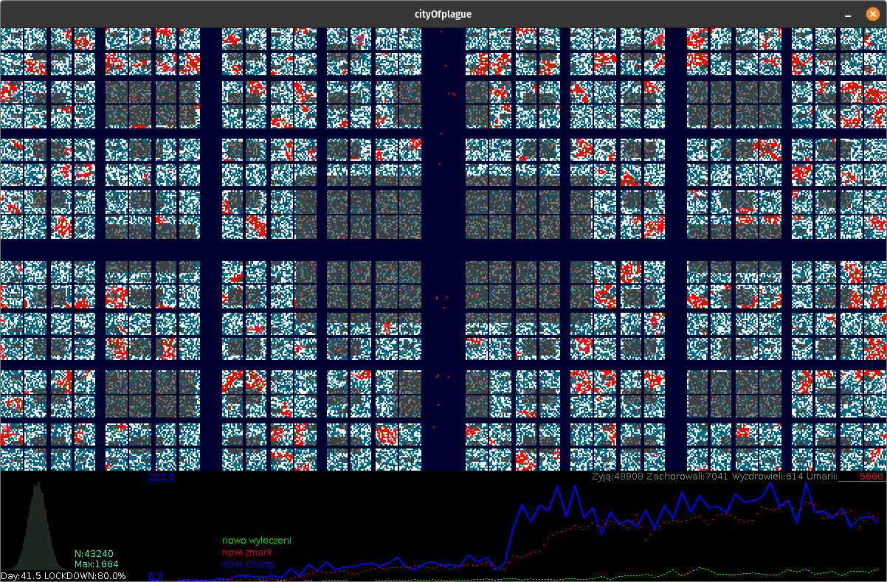

# _City Of Plague_

## "ABM model of plague on in the organized spatial environment" / PL: agentowy model przebiegu epidemii w przestrzeni zorganizowanej.

The repository contains a demonstration prototype of an agent-based model of an 
epidemic in a city as a space divided into three categories of areas where the 
same agents come into contact with each other in different configurations.

The program was created at the beginning of the __COVID19__ epidemic, and 
development work was abandoned when it turned out that many similar models had 
been created at that time. However, it is a good example of a complete, but 
not very complex simulation application.

The base language is __Processing__ version 3.x, but the code was written with 
automatic translation into __C++__ using the __Processing2C++__ tool in mind.

PL: W repozytorium znajduje się demonstracyjny prototyp agentowego modelu 
epidemii w mieście jako przestrzeni podzielonej na trzy kategorie obszarów, 
w których ci sami agenci wchodzą ze sobą w kontakty w różnych konfiguracjach.

Program powstał na początku epidemii __COVID19__, i prace rozwojowe zostały 
porzucone, gdy okazało się, że podobnych modeli powstało w tym czasie wiele. 
Stanowi jednak dobry przykład kompletnej, acz niezbyt skomplikowanej aplikacji 
symulacyjnej.

Językiem podstawowym jest __Processing__ w wersji 3.x, jednak kod był pisany 
z myślą o automatycznej translacji na język __C++__ za pomocą 
narzędzia __Processing2C++__.

### Basic assumptions / PL:Podstawowe założenia

1) The main idea of ​​the model is that agents actually become infected through 
   contact in various spaces in which they happen to be.
   Such a space is different for sleep and rest (place of residence in a 
   residential area), different for work (workplace), and events in
   special space are also possible - e.g. demonstrations (on the main street).
2) Both hosts and viruses (or rather their strains) are agents with
   a theoretical possibility of mutation.
3) One host at a given time can be the host of one strain of the virus.
4) The city is divided fractally by a network of streets and avenues of 
   different widths.

PL:
1) Główna idea modelu polega na tym, że agenci zarażają się faktycznie przez 
   kontakt w różnych przestrzeniach, w których zdarza im się przebywać. 
   Taka przestrzeń jest inna dla snu i odpoczynku (miejsce zamieszkania w dzielnicy
   mieszkaniowej), inna dla pracy (miejsce pracy), a możliwe są też zdarzenia w 
   przestrzeni specjalnej - np. demonstracje (na głównej ulicy).
2) Zarówno gospodarze jak i wirusy (a właściwie ich szczepy), są agentami z 
   teoretyczną możliwością mutacji.
3) Jeden gospodarz w danej chwili może być żywicielem jednego szczepu wirusa.
4) Miasto podzielone jest fraktalnie siecią ulic i alei o różnej szerokości.

 Screendump of application window </img>

### Access to the repository / PL:Dostęp do repozytorium

Read-only access via the _https_ protocol

```
git clone https://github.com/borkowsk/CityOfPlague-model.git

cd CityOfPlague-model.git

./_check.sh
cd src/cityOfplague/
```

Access with the possibility of modification can be obtained via the _ssh_ 
protocol, after obtaining appropriate rights from the author of the project.

```
git clone git@github.com:borkowsk/CityOfPlague-model.git

cd CityOfPlague-model.git
./_check.sh
cd src/cityOfplague/
```

NOTE! The name of the directory with _*.pde_ files must be the default, 
i.e. the same as the name of the main source file of the application. 
This is a requirement of __Processing__u: **src/cityOfplague/cityOfplague.pde**

PL:
Dostęp read-only za pomoca protokołu _https_

```
git clone https://github.com/borkowsk/CityOfPlague-model.git
cd CityOfPlague-model.git
./_check.sh
cd src/cityOfplague/
```

Dostęp z możliwością modyfikacji można uzyskać za pomocą protokołu _ssh_ , 
otrzymując uprzednio odpowiednie prawa od autora projektu.

```
git clone git@github.com:borkowsk/CityOfPlague-model.git
cd CityOfPlague-model.git
./_check.sh
cd src/cityOfplague/
```

UWAGA! Nazwa katalogu z plikami _*.pde_ musi być domyślna czyli taka sama jak 
nazwa głównego pliku źródłowego aplikacji. To jest wymaganie __Processing__u:

**src/cityOfplague/cityOfplague.pde**


## FINANCING / PL: FINANSOWANIE

This project is sponsored by __Centre For Systemic Risk Analisis__. 

* EN: https://cbrs.uw.edu.pl/en/home-page/
* PL: https://cbrs.uw.edu.pl/

## Authors (from ISS UW) / Autorzy (z ISS UW)

* Wojciech Tomasz Borkowski - programowanie
* Andrzej Krzysztof Nowak - cześć koncepcji

## Connections / Powiązania

* _"Compartmental models in epidemiology"_: https://www.wikiwand.com/en/Compartmental_models_in_epidemiology
* _"The SIR model of an epidemic"_ (April 2021): https://www.researchgate.net/publication/351105280_The_SIR_model_of_an_epidemic
* _"Komórkowy model epidemii"_ : https://github.com/borkowsk/bookProcessingPL/tree/master/15_epidemia
  

logos</img>


